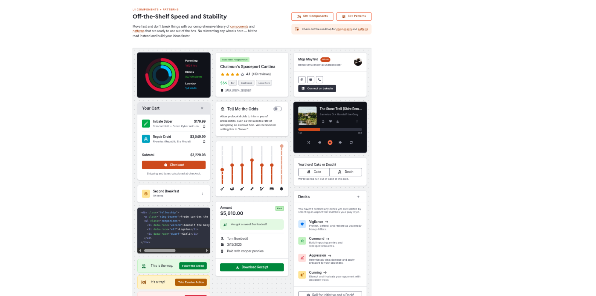
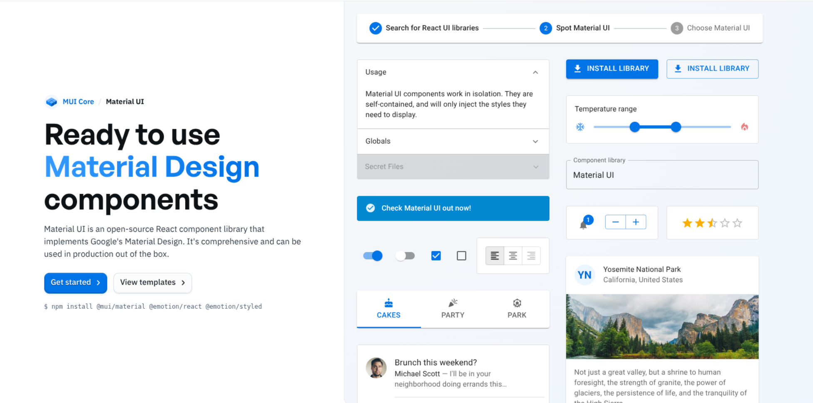
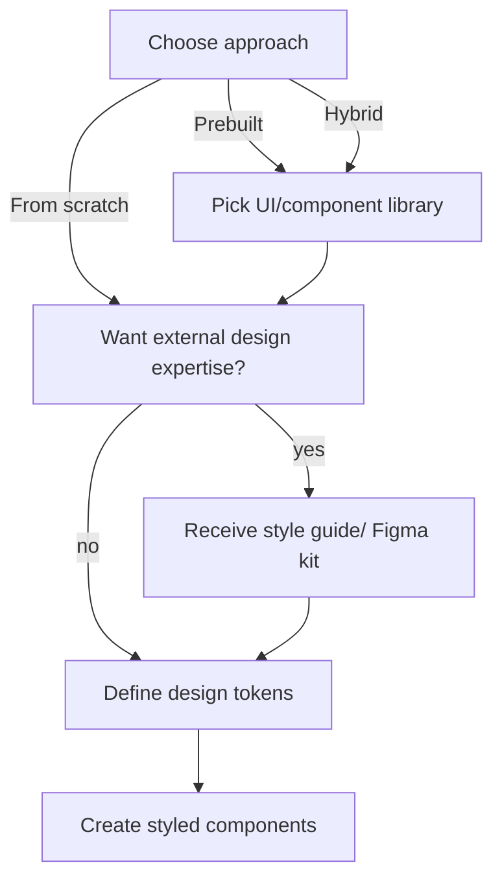

# Design System

for the next generation web client

---

# What's a Design System ?

What it is.

- concerns applications *"Look & Feel"*
- is a set of guidelines, rules, patterns, ...
- gets agreed upon and then followed during development

## Benefits

- Users: provide cohesive user experience across whole app
- Mangement: lessen decision making & reduce technical debt
- Developers: simplify & accelerate development workflow

## Goal

*Maintain a style guide, available to the whole team, that defines in detail how things should look.*

---
layout: two-cols
---

# What's a Design System ?

What it contains.

::left::

## Design tokens

*Atomic style variables, ie.*

- typography (font family, weights, headlines, ...)
- colors (accent, secondary, error, success, ...)
- spacing (margins, paddings, gaps, ...)
- icons (icon set, semantics)

::right::

## Components

*Interactive & form elements, ie.*

- buttons
- text inputs
- checkboxes, radios
- dropdowns, selects
- calendars
- charts
- ... and thousands more

---
layout: three-cols
---

# Adopting a Design System

Using existing solutions or creating new.

::left::

## *Prebuilt*

Use existing

- Pick fitting UI/component framework
- Adjust colors, fonts & minor tweaks

<ul>
<li class="plus">Little additional work</li>
<li class="plus">Cohesive look & feel</li>
<li class="plus">Loads of stable components</li>
<li class="minus">Generic appearance</li>
<li class="minus">Very dependent on 3rd party</li>
</ul>

::center::

## *Hybrid*

Modify existing

- Pick fitting UI/component framework
- Define design tokens
- Reset & override styles
<ul>
<li class="plus">Unique brand design</li>
<li class="plus">Loads of stable components</li>
<li class="minus">Maintenance & migrating</li>
<li class="minus">Dependent on 3rd party</li>
</ul>

::right::

## *From scratch*

Create new

- Define design tokens
- Style native HTML elements

<ul>
<li class="plus">Fully independent</li>
<li class="plus">Unique brand design</li>
<li class="minus">Lots of work</li>
<li class="minus">Complex components are big pain</li>
<li class="minus">Pitfalls: responsiveness, accessability, polyfills</li>
</ul>

---

# Picking a UI library

What to look out for.

- *Pricing model:* Are all components available or are some paywalled?
- *Customization:* How easy can styles be adjusted & overriden?
- *Dependencies:* Is the library itself depending on other 3rd party libraries?
- *Templates:* Does the library offer prebuilt UI blocks?
- *UI kits:* Does the library offer style definition files (eg. Figma, Adobe XD, ...)?

Obvious other concerns are stability, adoption among big players, history, similarity to current design, ...

---

# UI libraries

## *PrimeReact*

 

- By *PrimeFaces*
- Also available for *Angular* & *Vue*
- Well suited for style reset & customization

 

---

# UI libraries

## *shadcn*

 

- By *Vercel*
- Uses *TailwindCSS* and wraps around *Radix UI* components
- Uses local components (they live inside the project)

 

---

# UI libraries

## *WebAwesome*

 

- By *FontAwesome* creators
- Tightly follows web standards
- Framework agnostic

 

---

# UI libraries

## *Material UI*

 

- Seems quite popular
- Extensive customization/theming options
- Considerable paywalls

 

---

# Not a UI library

## *TailwindCSS*

 

- CSS utility framework
- Not a component library
- No distinct look or style

 

---

# External Web designer

Considering outside expertise.

## Potential issues

- How to transport the current look and feel to new client?
- How to adopt UI framework style to our needs and style?
- How to create/maintain a style definition document?

## A Web designer could...

- ... take into account the current applications design
- ... use a UI frameworks style kit as a base
- ... condense both into a fresh/rebranded brand style
- and create a *standardized style guide* as reference for developers.

---

# Decisions, decisions...

What the next steps could be.

